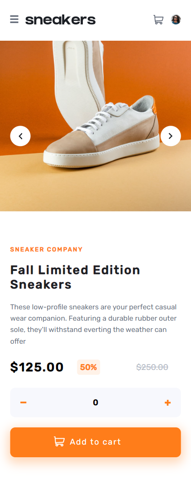
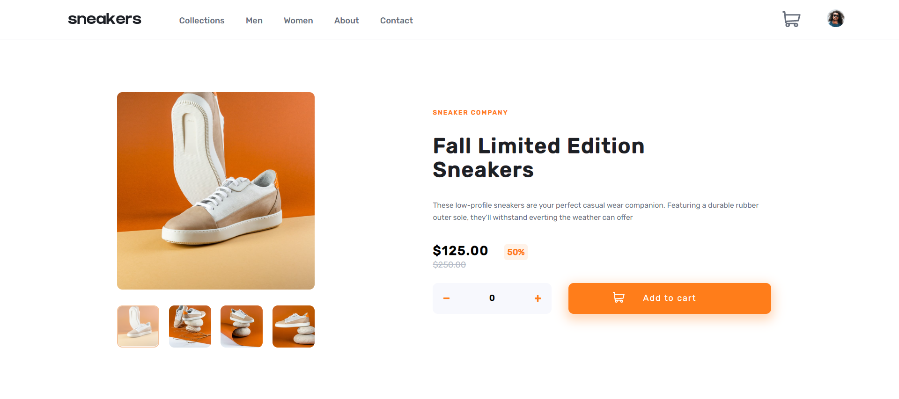

# Frontend Mentor - E-commerce product page solution

This is a solution to the [E-commerce product page challenge on Frontend Mentor](https://www.frontendmentor.io/challenges/ecommerce-product-page-UPsZ9MJp6). Frontend Mentor challenges help you improve your coding skills by building realistic projects.

## Table of contents

- [Overview](#overview)
  - [The challenge](#the-challenge)
  - [Screenshot](#screenshot)
  - [Links](#links)
- [My process](#my-process)
  - [Built with](#built-with)
  - [What I learned](#what-i-learned)
- [Author](#author)
- [Acknowledgments](#acknowledgments)

## Overview

### The challenge

The designs were created to the following widths:

- Mobile: 375px
- Desktop: 1440px

  Users should be able to:

- View the optimal layout for the site depending on their device's screen size
- See hover states for all interactive elements on the page
- Open a lightbox gallery by clicking on the large product image
- Switch the large product image by clicking on the small thumbnail images
- Add items to the cart
- View the cart and remove items from it

### Screenshot

### Links

- Solution URL: [https://github.com/MonaElshikh/ecommerce-product-page]
- Live Site URL: [https://monaelshikh.github.io/ecommerce-product-page]

## My process

### Built with

- Semantic HTML5 markup
- CSS custom properties
- Flexbox
- Mobile-first workflow
- Typescript
- Scss
- gulp.js

### What I learned

- I learned Scss and Gulp js while doing this challange , It was very challanged to practise them , i faced some issues searched and fixed them.

## Author

- Frontend Mentor - [@yMonaElshikh](https://www.frontendmentor.io/profile/MonaElshikh)

## Acknowledgments

Thanks alot Frontendmentor for your support :)
